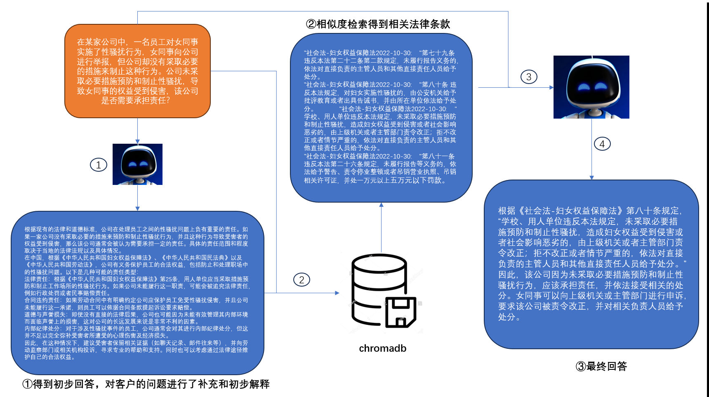

# “獬豸”智慧律师系统
## 项目简介
目前市面上的AI大模型在法律咨询方面严重缺乏专业性，我开发的这个系统从[中华人民共和国法律手册](https://github.com/LawRefBook/Laws)上学习最核心的9k条法律条文，能最大程度地根据真实法律给予客户真实可参考的法律条款，模拟真实律师口吻解决客户法律相关咨询。
## 致谢
本项目真实场景法律咨询数据来自 [LAW_GPT](https://github.com/LiuHC0428/LAW_GPT) 项目，相关法律条款来自 [中华人民共和国法律手册](https://github.com/LawRefBook/Laws) 项目，特此感谢 Hongcheng Liu, Yusheng Liao, Yutong Meng, Yuhao Wang 等作者的开源工作。
## 项目架构
本系统基于Langchain v1.0搭建流水线，整体架构思路分文三个步骤：

①初步解释；将客户问题给予Qwen2.5-7B，得到初步回答。这一步可以解决由于客户咨询问题过于模糊导致的chromadb相似度匹配准确度过低的问题。

②数据库相似度匹配；依据客户咨询问题和①中初步生成的解释，从中华人民共和国法律手册数据库中检索出与客户问题相关的若干条法律条款，以供③生成模拟专业律师回答。

③模拟专业律师回答；将用户咨询问题和相关法律条款输入律师问答模型，生成模拟专业律师口吻的回答。
该模型基于 [LiquidAI/LFM2-350M](https://huggingface.co/LiquidAI/LFM2-350M) 经过Lora微调得到。



## 开始
### 配置环境依赖
```pip install -r requirements.txt```

### 数据下载
[中华人民共和国法律手册](https://github.com/LawRefBook/Laws)下载相关法律条款放到 ``` .data ``` 目录下。

[LAW_GPT](https://github.com/LiuHC0428/LAW_GPT) 下载真实场景法律咨询案例放到 ```.data/真实场景法律咨询``` 目录下

### 模型微调
利用真实场景法律咨询数据微调律师问答模型，使之能更好地模拟真人律师回答客户咨询。

```python .model/model_peft.py```

### 系统运行

```python .model/model_peft.py```

### 命令行运行模拟

```aiignore
Human:
如果一个公司申请破产，通知和公告应当包含哪些信息？这些信息为什么这么重要？
--------------------------------
Lawyer:
根据《民法商法-企业破产法》，如果一个公司申请破产，通知和公告应当载明申请人、
被申请人的名称或者姓名，人民法院受理破产申请的时间，申报债权的期限、地点和注
意事项，管理人的名称或者姓名及其处理事务的地址，债务人的债务人或者财产持有人
应当向管理人清偿债务或者交付财产的要求，第一次债权人会议召开的时间和地点，以
及人民法院认为应当通知和公告的其他事项。这些信息对于保障破产程序的公开、公平、
公正非常重要，可以让申报债权人及时了解破产相关事项，维护其合法权益。同时也可
以为管理人提供必要信息，协助其妥善处理债务清偿事宜。
```

## 引用
本项目在开发过程中参考 [LAW_GPT](https://github.com/LiuHC0428/LAW_GPT) 项目的数据和设计思路。如果你在学术研究中使用本项目，请同时引用原项目：

```bibtex
@misc{LAWGPT-zh,
  author={Hongcheng Liu, Yusheng Liao, Yutong Meng, Yuhao Wang},
  title = {XieZhi： Chinese Law Large Language Model},
  year = {2023},
  publisher = {GitHub},
  journal = {GitHub repository},
  howpublished = {\url{https://github.com/LiuHC0428/LAW_GPT}},
}
